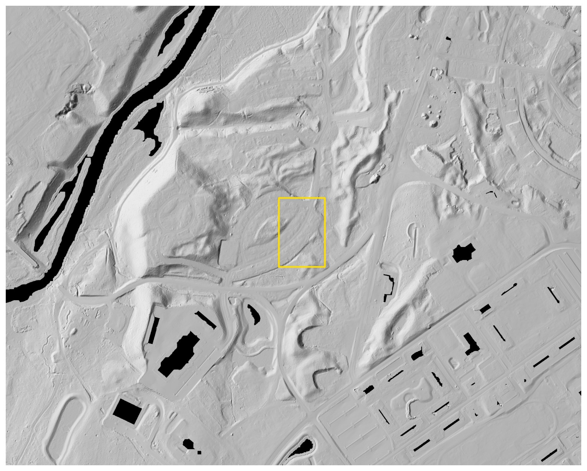

# Lidar Site Studies

Planning-level terrain intelligence for wooded land in Massachusetts.

[View the live site](https://maxwellhowegis.com/lidar-test/)



## What this demonstrates

Lidar Site Studies combines lidar, aerial imagery, and GIS analysis to help answer early land questions before a buyer, owner, or project team commits to full design work.

The service concept has three levels:

1. **Public-data screen** — check terrain, mapped constraints, likely access, and data age.
2. **Fresh flight** — acquire current lidar and imagery with an FAA Part 107 remote pilot when public data is too old or incomplete.
3. **Decision report** — turn the terrain into a short, visual explanation of the risks, comparisons, and recommended next diligence steps.

This repository is a portfolio and client-conversation demo by **Max Howe, MS, Geographic Information Science**. It is not yet presented as an operating survey or engineering firm. Work requiring licensed land surveying or professional engineering would be scoped with appropriately licensed partners.

## Case studies

| Study | Question | Main lesson |
| --- | --- | --- |
| [Devens](https://maxwellhowegis.com/lidar-test/devens.html) | Can a camera surface stand in for ground under trees? | Canopy can overwhelm an early grading comparison. |
| [Middleborough](https://maxwellhowegis.com/lidar-test/middleboro.html) | What does flat-looking wooded land hide? | Small terrain differences can affect drainage and conceptual earthwork. |
| [Hopkinton](https://maxwellhowegis.com/lidar-test/hopkinton.html) | Where should one warehouse concept sit? | Moving the same pad can change modeled earthwork by millions. |
| [I-495 corridor](https://maxwellhowegis.com/lidar-test/p04.html) | Which parcels deserve deeper diligence? | A consistent first screen can reduce a long list to a manageable shortlist. |

## Important limits

The case studies are planning-level demonstrations from public data. They are useful for comparison and diligence planning, but they are **not**:

- property or boundary surveys;
- wetland delineations;
- grading, drainage, or civil engineering designs;
- geotechnical investigations;
- construction quantities, estimates, or bids;
- findings that a parcel is legally buildable, permitted, or accessible.

The modeled costs use an illustrative unit rate for comparison. A real project needs current contractor or estimator input. Read the [full method, sources, and limitations](https://maxwellhowegis.com/lidar-test/methodology.html) before relying on a number.

## Repository guide

- `index.html` — service-focused homepage
- `devens.html`, `middleboro.html`, `hopkinton.html`, `p04.html` — case studies
- `methodology.html` — public-facing method, sources, and limitations
- `site.css`, `site.js` — shared responsive design and accessible interactions
- `assets/` — maps and imagery used by the demonstrations
- `METHODOLOGY.md`, `DATA_SOURCES.md` — repository documentation
- `scripts/validate-site.mjs` — dependency-free local site check

Run the validation locally with Node.js:

```powershell
node scripts/validate-site.mjs
```

This is a static site, so it can also be previewed with any simple local web server.

## Contact

Max Howe · [mhowe.gis@gmail.com](mailto:mhowe.gis@gmail.com)

## Rights and data credits

Site copy, design, and original analysis are copyright © 2026 Max Howe. All rights reserved. Public-agency datasets and third-party basemap imagery retain their own terms and credits. See [LICENSE.md](LICENSE.md) and [DATA_SOURCES.md](DATA_SOURCES.md).
